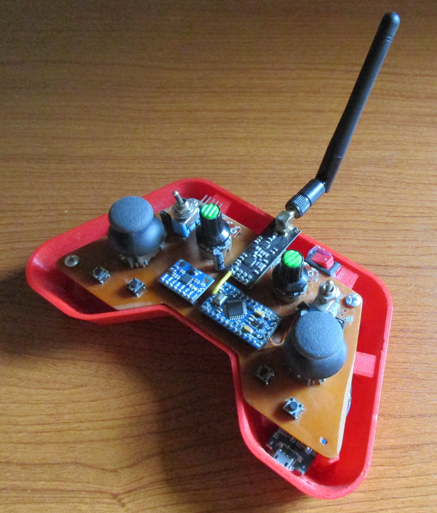

El sistema permite el control remoto de actuadores (como servos o robots) mediante un enlace inalámbrico de baja latencia.

---

## Imágenes




---

## Características principales

- Comunicación inalámbrica 2.4 GHz con nRF24L01
- Alimentación portátil con baterías 18650
- Programación en bajo nivel usando AVR Studio
- Lectura de 2 joystick analógico (ejes XY + botón)
- Envío de múltiples variables en tiempo real
- Diseño mecánico propio (carcasa personalizada)

---

## Descripción del sistema

El sistema está compuesto por dos módulos:

### Transmisor (Joystick)
- Lee valores analógicos del joystick (X, Y)
- Detecta estado de botón
- Envía datos vía nRF24L01

### Receptor
- Recibe los datos inalámbricos
- Controla actuadores (servo, robot, etc.)

El módulo nRF24L01 opera en la banda de 2.4 GHz con tasas de hasta 2 Mbps y alcance típico de ~100 m en espacio abierto :contentReference[oaicite:0]{index=0}.

---

## Hardware utilizado

### Transmisor
- Arduino Pro Mini (ATmega328P)
- Módulo nRF24L01
- Joystick analógico (2 ejes + botón)
- Batería 18650
- Regulador de voltaje (step-down a 3.3V / 5V)
- Switch de encendido
- PCB / protoboard

### Receptor
- Arduino (Uno / Nano / Pro Mini)
- Módulo nRF24L01
- Servo motor / Motor paso a paso (ver [Proyecto de Microcontroladores](https://github.com/emaa877/Microcontroladores)

---

## Conexión del nRF24L01

El módulo utiliza comunicación SPI:

| nRF24L01 | Arduino Pro Mini |
|---------|----------------|
| VCC     | 3.3V |
| GND     | GND |
| CE      | D7 |
| CSN     | D8 |
| SCK     | D13 |
| MOSI    | D11 |
| MISO    | D12 |

Importante:
- NO alimentar con 5V
- Se recomienda capacitor (10µF–100µF) entre VCC y GND para estabilidad

---

## Alimentación (Batería 18650)

El sistema es portable gracias a una batería 18650:

- Voltaje nominal: 3.7V
- Uso de módulo step-up/down según configuración
- Protección recomendada (BMS)

Configuración típica:
- 18650 → Regulador → 5V (Arduino)
- 18650 → Regulador → 3.3V (nRF24L01)

---

## Software

### Entorno
- AVR Studio (Atmel Studio)
- Programación en C/C++ sin abstracciones Arduino

### Librerías
- SPI (implementación AVR)
- RF24 (adaptada para AVR)

---

## Comunicación inalámbrica

El sistema utiliza:
- Protocolo SPI para comunicarse con el módulo
- Direcciones ("pipes") para transmisión
- Comunicación bidireccional opcional

Ejemplo conceptual:

```c
typedef struct {
    uint16_t joyX;
    uint16_t joyY;
    uint8_t button;
} DataPackage;
